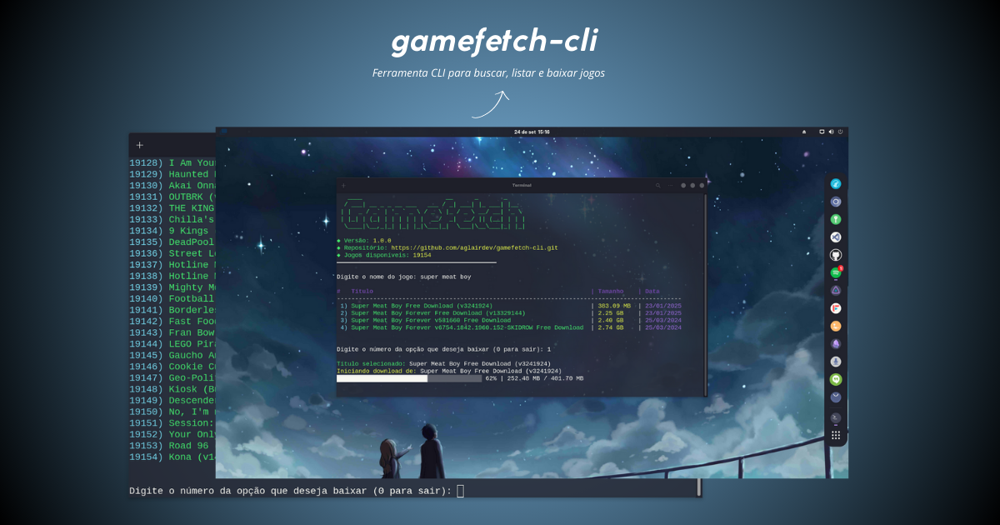

<h2 style="display: flex; align-items: center; gap: 8px;">
  
  <span>Demo</span>
</h2>

<div>
  
</div>

<br>

> [!WARNING]
> A ferramenta agrega fontes externas com autoria de terceiros.


<h2 style="display: flex; align-items: center; gap: 8px;">
  
  <span>Instalação</span>
</h2>

```bash
curl -sL https://raw.githubusercontent.com/aglairdev/gamefetch-cli/main/install.sh | bash
```

<h2 style="display: flex; align-items: center; gap: 8px;">
  
  <span>Flags</span>
</h2>

```bash
-l         Listar todos os jogos
-l<ID>     Baixar jogo pelo ID (ex: -l5)
-h         Mostrar ajuda
```

<h2 style="display: flex; align-items: center; gap: 8px;">
  
  <span>Creditos</span>
</h2>

- [Hydra Library](https://library.hydra.wiki/library)
- [Bootstrap](https://getbootstrap.com/)